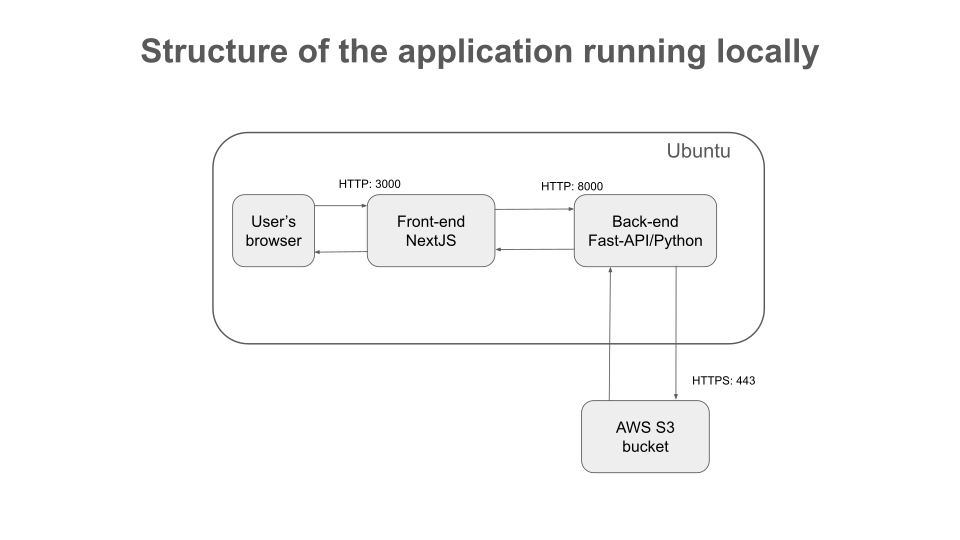
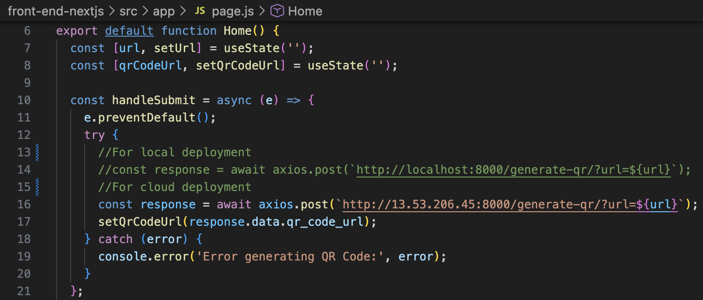
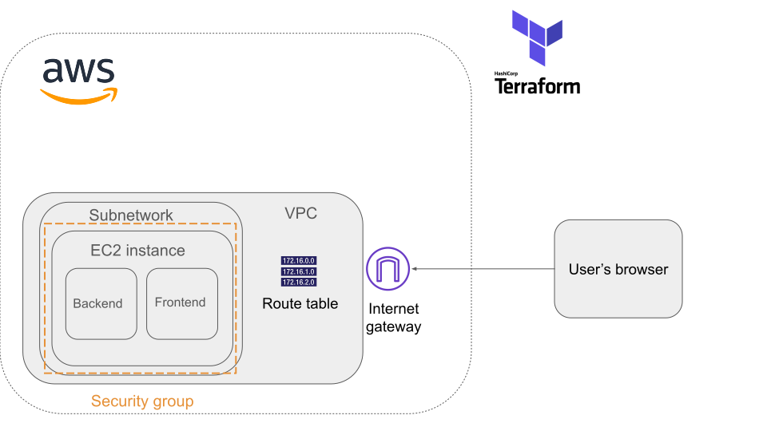

# Project

The objective of this project is to design and develop a minimal set up required for the continuous integration and continuous deployment (CI/CD) of a web application.

The app —sourced from @rishabkumar7 in [devops-qr-code](https://github.com/rishabkumar7/devops-qr-code)— consists on a Next.js frontend that receives a URL, and a Python/FastAPI backend that returns a QR code.

## Running the application locally

The diagram below depicts the interaction of the different components of the application.

To run it locally without docker, please refer to the instructions in [devops-qr-code](https://github.com/rishabkumar7/devops-qr-code) repository.

**Note:** Before starting the application locally, you must update the API endpoint to the local development environment. This configuration is located in `front-end-nextjs/src/app/page.js`, specifically within the lines highlighted below:

### Dockerization

Both the backend and frontend have been containerized using Docker. A GitHub Actions workflow was implemented to automate the build and push process to DockerHub. This pipeline triggers on every push to the master branch, ensuring that the latest images are always available, as illustrated in the diagram below.

To run the application locally with docker, run the command `docker compose up`.

**Note:** Since the `compose.yaml` file is located in the project's root (`./`), there must be a `.env` file containing the AWS credentials for the API also in the project's root, following the structure of `./api/.env.example`.

## Deployment in cloud

The application is hosted on AWS, with the infrastructure fully defined via Terraform. The following diagram depicts the cloud resources and network configuration used to expose the application to the internet:

To provision the cloud infrastructure, navigate to the `./infrastructure/` directory and execute the following commands:

- `terraform init`
- `terraform apply`

Once you have done this your AWS VPC will be ready to host the application. In order to do so, follow the steps:
- Connect through EC2 Instance Connect to the EC2 instance.
- Update the API endpoint in `front-end-nextjs/src/app/page.js`, so that the IP matches the public IP of the EC2 instance.
- Build and push to DockerHub a new image of the API.
- The `compose.yaml` file is located in the instance's home directory. You must uncomment the environment variables within the file to proceed.
- Execute `docker compose up -d`.

Once these steps are completed, the frontend will be active on port 80. To access the application, simply navigate to the EC2 instance's public IP address in your web browser.

## Authentication & Security

AWS credentials are required by Terraform and the backend. Terraform utilizes the credentials stored in `~/.aws/credentials` on your local machine to provision the AWS cloud infrastructure. This file is expected to be in the format:

`[default]` 
`aws_access_key_id = *****************` 
`aws_secret_access_key = ******************`

 On the other hand, the backend requires credentials to be defined as environment variables in `./api/.env` to access the S3 bucket. In accordance with security best practices, two different users were defined for each one of these needs with both sets of credentials following the Principle of Least Privilege (PoLP).

Furthermore, Terraform will look for an SSH key pair in `~/.ssh/` named `id_rsa_aws`. These keys are required for the SSH tunnel used to communicate securely with the EC2 instance.

## Author

[Camilo Nuñez](https://github.com/camillonunez1998)

## License

[MIT](./LICENSE)